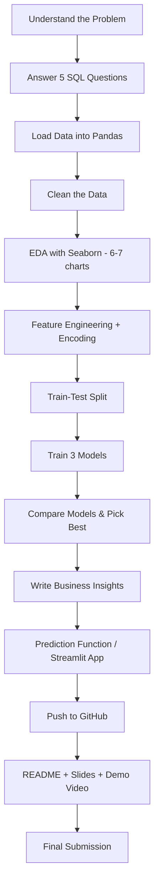

# Common Guidelines — All 4 Capstone Projects

These rules apply to every capstone in this folder (`01`–`04`). Each project file only contains
what's specific to it — domain, dataset, SQL questions, charts, models, insights. Read this file
once first, then open any single project file end to end.

**Difficulty:** Easy–Intermediate (beginner-friendly, but with real end-to-end rigor — 3 models,
a working prototype, and a proper GitHub submission, not just a notebook).

---

## 1. Project Details

- **Difficulty:** Easy–Intermediate
- **Duration:** 10 Days
- **Mode:** Individual
- **Tools:** Google Colab or Jupyter Notebook, SQLite (or any SQL playground), Python (Pandas, Seaborn, Scikit-learn), Git + GitHub, optional Streamlit

## 2. Scope for Each Project

- One clean, well-known public dataset.
- **SQL:** `SELECT`, `WHERE`, `GROUP BY`, `HAVING`, a simple `JOIN` where relevant, and **one basic subquery** question. Still no CTEs or window functions — that stays for the SQL week itself.
- **EDA:** 6–7 Seaborn charts, each with a written observation (1–2 lines). Includes at least one correlation/relationship chart (heatmap, pairplot, or faceted chart).
- **Feature engineering:** handle missing values, encode categorical columns, scale where needed, **plus one derived/engineered feature** specific to the dataset (e.g., a ratio, a date difference, a bucketed column).
- **Models: 3 models per project** — one baseline (Linear/Logistic Regression), one tree-based model (Decision Tree), and one ensemble model (Random Forest). This is the main difficulty bump versus a pure-beginner version.
- **Prototype:** a Python prediction function is the minimum bar; a small **Streamlit app is strongly encouraged** (still optional, called out per project).

## 3. Standard Project Flow



## 4. Model Evaluation

**Regression:** report R², MAE, and RMSE. Include a predicted-vs-actual chart for the best model.

**Classification:** report Accuracy, Precision, Recall, F1-score, and a Confusion Matrix. Note which
metric matters most for the business problem (e.g., Recall matters more than Accuracy when missing
a positive case — churn, attrition, no-show, default — is the costly mistake).

Comparison table (fill in after training):

| Model | Metric 1 | Metric 2 | Metric 3 | Which is better and why |
|---|---:|---:|---:|---|
| Model 1 — Baseline (Linear/Logistic Regression) | | | | |
| Model 2 — Decision Tree | | | | |
| Model 3 — Random Forest | | | | |

## 5. 10-Day Execution Plan (template)

| Day | Focus | Deliverable |
|---|---|---|
| 1 | Understand the problem, set up GitHub repo, download dataset, answer 5 SQL questions | Repo initialized + SQL answers committed |
| 2 | Load data into Pandas; check missing values, duplicates, dtypes; clean | Cleaned dataset committed |
| 3 | EDA — first 3–4 Seaborn charts (distribution + count) | Charts + observations committed |
| 4 | EDA — remaining charts (relationship + correlation) | Full EDA section committed |
| 5 | Feature engineering (derived feature + encoding), train-test split | ML-ready dataset committed |
| 6 | Train Model 1 (baseline) and Model 2 (Decision Tree), evaluate both | Baseline results committed |
| 7 | Train Model 3 (Random Forest), build comparison table, pick best model | Comparison table + best model chosen |
| 8 | Write business insights; build prediction function / Streamlit app | Insights + working prototype committed |
| 9 | Write README, add `requirements.txt`, make 8–10 slides | Repo polished, slides draft ready |
| 10 | Record 5–7 minute demo video, final GitHub push, submit | Final submission link shared |

---

## 6. GitHub Workflow (required)

Yes — every student must use GitHub for submission. Follow this workflow:

1. **Create the repository** on GitHub: `<your-name>-<project-name>-capstone` (e.g., `ankit-house-price-capstone`), public, with a default README.
2. **Clone it locally**: `git clone <repo-url>`
3. **Work day by day** and commit as you go — don't do one giant commit at the end. Suggested commit checkpoints:
   - `Day 1: add SQL questions and answers`
   - `Day 2: clean dataset`
   - `Day 3-4: add EDA charts and observations`
   - `Day 5: feature engineering and train-test split`
   - `Day 6-7: train and compare models`
   - `Day 8: add business insights and prediction prototype`
   - `Day 9: add README, requirements.txt, and slides`
   - `Day 10: final polish`
4. **Push regularly**: `git add <files>` → `git commit -m "message"` → `git push`
5. **Do not commit secrets** (API keys for any LLM step) — use environment variables and add `.env` to `.gitignore` if applicable.
6. Final repo must have a clean, working `main` branch that runs top-to-bottom without errors.

### Suggested Repository Structure

```text
<project-name>-capstone/
│
├── data/
│   └── dataset.csv              # or a note with the download link if the file is too large
│
├── notebooks/
│   └── analysis_modeling.ipynb  # SQL section + cleaning + EDA + modeling, in order
│
├── sql/
│   └── questions.sql            # the 5 SQL questions and answers
│
├── app/
│   └── app.py                   # optional Streamlit prototype
│
├── models/
│   └── best_model.pkl           # saved with pickle/joblib
│
├── presentation/
│   └── slides.pdf
│
├── requirements.txt
├── .gitignore
└── README.md
```

A single well-organized notebook plus this folder shell is enough — the goal is a repo that looks
professional and is easy for a reviewer to navigate, not maximum complexity.

---

## 7. Required Deliverables

1. **GitHub repository link** (public, following the structure above)
2. Dataset file, or a documented download link if too large for GitHub
3. SQL questions and answers (`sql/questions.sql` or a notebook section)
4. Notebook with cleaning, EDA, feature engineering, and modeling
5. `requirements.txt` listing every library used
6. README (see structure below)
7. 8–10 slide presentation (PDF)
8. 5–7 minute demo video (link — YouTube unlisted, Loom, or Google Drive)
9. Saved model file (`.pkl`)
10. Working prediction function, or Streamlit app if attempted

## 8. README Structure

1. Project title and one-line problem statement
2. Dataset used (name, link, size)
3. Tools and libraries used
4. SQL questions answered (list them)
5. EDA summary (2–3 key findings)
6. Feature engineering notes
7. Models used and comparison table
8. Final model selected and why
9. Business insights and recommendations
10. How to run the project (setup + run instructions)
11. Demo video link
12. Team member name

## 9. Presentation Structure (8–10 slides)

1. Title
2. Problem Statement
3. Dataset Overview
4. SQL Findings (key business questions answered)
5. EDA Highlights (Seaborn charts)
6. Feature Engineering & Preprocessing
7. Models Used & Why
8. Model Evaluation & Comparison
9. Business Recommendations
10. Prototype Demo & Conclusion / Future Work

## 10. Demo Video Expectations (5–7 minutes)

Explain, in order: the problem, the dataset, the SQL questions and findings, the EDA insights, the
models trained and why the best one was chosen, the business recommendation, and a live demo of the
prediction function or Streamlit app.

## 11. Submission Checklist

Before submitting, confirm every item is true:

- [ ] GitHub repo is public and the link works in an incognito window
- [ ] `main` branch runs top-to-bottom without errors
- [ ] At least 5 commits showing incremental progress (not one bulk commit)
- [ ] 5 SQL questions answered, including one subquery
- [ ] Missing values and duplicates checked and handled
- [ ] At least 6 Seaborn charts, each with a written observation
- [ ] One engineered/derived feature, clearly explained
- [ ] 3 models trained and compared with the correct metrics
- [ ] Best model selected with a written justification
- [ ] At least 2 business insights tied back to the data
- [ ] A working prediction function (or Streamlit app)
- [ ] README completed with all sections above
- [ ] `requirements.txt` present and accurate
- [ ] Presentation (8–10 slides) attached
- [ ] Demo video recorded and linked
- [ ] Repo link + video link submitted through the course submission form / LMS by the deadline

### How to Submit

Submit the following in the course submission form (or as instructed by your mentor):

1. GitHub repository link
2. Demo video link
3. One-paragraph summary of your business insight (pasted directly into the form)

Late/incomplete submissions should still include the GitHub link — partial credit is given for
completed days even if the full 10-day plan wasn't finished.

## Common Mistakes to Avoid

1. Skipping the SQL step or the subquery question
2. Charts with no written observation
3. Judging classification models on accuracy alone
4. Forgetting to encode categorical columns before training
5. Not writing a plain-language business takeaway
6. One giant commit at the end instead of daily commits
7. Missing `requirements.txt`, so the reviewer can't run the notebook
8. Dataset or model file too large for GitHub with no download link noted

---

## 12. Index of the 4 Capstones

| # | File | Domain | ML Task | Dataset |
|---|---|---|---|---|
| 1 | [01_house_price_prediction.md](01_house_price_prediction.md) | Real Estate | Regression | House Price (Kaggle) |
| 2 | [02_employee_attrition_prediction.md](02_employee_attrition_prediction.md) | HR Analytics | Classification | IBM HR Attrition |
| 3 | [03_superstore_sales_profit_analytics.md](03_superstore_sales_profit_analytics.md) | Retail | Regression | Superstore Sales |
| 4 | [04_loan_default_prediction.md](04_loan_default_prediction.md) | Banking | Classification | Loan Prediction Dataset |

> **Note on dataset links:** these are well-known, standard Kaggle/UCI datasets. If a link has moved, search Kaggle for the dataset name given.
